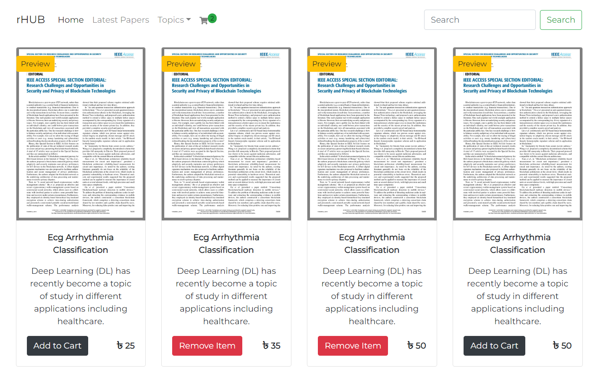

# rHub :  Your Online Hub for Research Papers

rHUB is an innovative platform designed to streamline access to a wide array of research papers. 
This project aims to create an intuitive and secure e-commerce platform where users can easily explore, purchase, 
and access diverse research papers across various disciplines. Empowering researchers, students, 
and knowledge seekers with a convenient marketplace, rHUB provides a seamless experience for discovering and acquiring valuable academic resources.



## Installation

Clone the repository, install the dependencies and start the application:

```bash

git clone https://github.com/Remonhasan/rHUB.git

```
## Dependencies 

### Install npm 
```
npm install

```
### Start the application

```
npm start
#or
#npm run dev

```

Made with 💙 for JavaScript !
